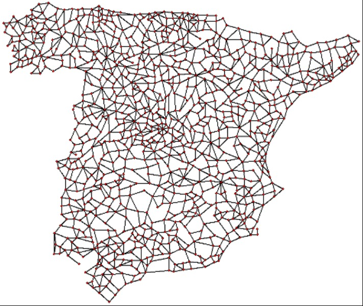

# EL RETO DEL VIAJANTE 
## Presentación
Un maestro decide aprovechar sus proverbialmente largas vacaciones para hacer turismo por España; tanto que piensa que tendrá tiempo suficiente para visitar por todos los pueblos, ciudades, aldeas, villorios, urbes y caseríos de la península. Pero como no tiene el sueldo de un ministro y el precio del petróleo está por las nubes, tendrá que planificar al milímetro la ruta a seguir para minimizar la distancia total recorrida. Con mucha paciencia se ha creado un mapa con los más de 1000 sitios a visitar, incluyendo las carreteras nacionales y comarcales que los unen. Comoquiera que reside en Murcia, su ruta deberá empezar y acabar en la capital murciana.

## El Problema
Dado un grafo no dirigido, conexo y etiquetado con pesos enteros, encontrar el ciclo de menor coste que visite todos los nodos por lo menos una vez. Es decir, el ciclo debe pasar por todos los nodos del grafo una o más veces. Se pueden repetir las aristas del ciclo. Además, el ciclo debe empezar y acabar en un nodo fijado de antemano.

## Entrada
La descripción del grafo de ciudades y carreteras viene dada en el fichero de texto **entrada.txt**, que tiene el siguiente formato. La primera línea contiene un único número, N, que indica el número total de nodos del grafo. La siguiente línea contiene otro entero, M, que indica el número de aristas del grafo. La tercera línea también contiene un único entero, F, que indica el nodo que debe ser inicio y fin del ciclo. Los nodos del grafo son numerados desde 1 hasta N.

A continuación vienen N líneas, una por cada nodo. Cada línea i-ésima contiene dos enteros separados por un espacio en blanco: Xi, Yi, que indican las coordenadas relativas de la ciudad i-ésima en el mapa. Esta información se ofrece simplemente a efectos de visualización del grafo.

Finalmente vienen M líneas, una por cada arista del grafo. Cada línea contiene tres enteros separados por espacios en blanco: U, V, C, siendo U y V los nodos unidos por la arista y C el coste de la misma. Recordar que el grafo es no dirigido, por lo que la arista (U, V) y la (V, U) son la misma.

## Salida
La salida debe ser un fichero de texto con el siguiente formato. La primera línea contendrá un único número entero, **P**, que indicará el coste total del ciclo encontrado (es decir, la suma de los costes de las aristas por las que pasa). La siguiente línea contendrá otro entero, T, que indicará el número total de nodos del ciclo, contando dos veces el nodo de comienzo y fin del ciclo. A continuación vendrán T líneas, cada una con un entero entre 1 y N, que indicarán los sucesivos nodos del ciclo encontrado. La primera y la última de estas líneas deberán tener necesariamente el valor F, que corresponde al nodo de Murcia.

